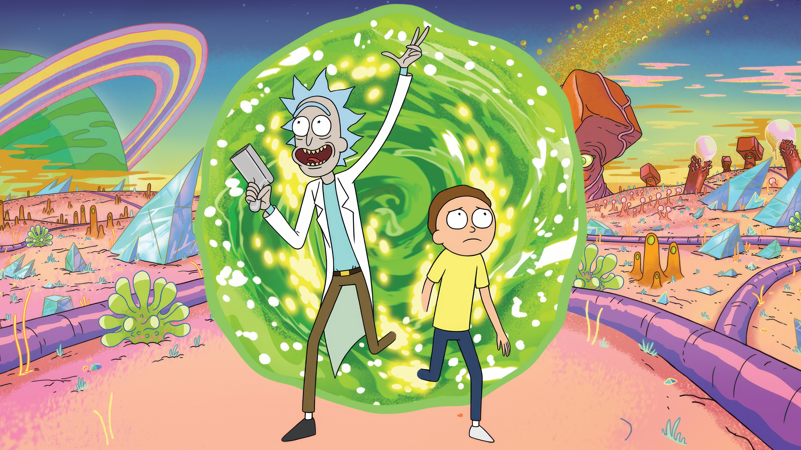

# 🌀 Portal Rick and Morty

Portal web interativo para explorar o universo de Rick and Morty através da API GraphQL oficial. Desenvolvido com Vue 3, TypeScript e Vite.

<div align="center">
  


[](https://vuejs.org/)
[](https://www.typescriptlang.org/)
[](https://vitejs.dev/)
[](https://graphql.org/)

</div>

---

## ✨ Funcionalidades

### 🏠 Home
- Hero section com wallpaper animado da série
- Slideshow automático com múltiplas imagens
- Estatísticas em tempo real (826 personagens, 126 localizações, 51 episódios)
- Cards interativos para navegar pelas seções
- Design responsivo e moderno
- Scroll suave e navegação intuitiva

### 👽 Personagens
- Lista completa de todos os 826 personagens
- Busca por nome
- Filtro por status (Vivo, Morto, Desconhecido)
- Cards com informações detalhadas (status, espécie, origem, localização, episódios)
- Traduções de nomes e informações para português
- Paginação (20 personagens por página)
- Exibição da primeira aparição de cada personagem

### 🌍 Localizações
- Exploração de 126 localizações únicas
- Busca por nome, tipo e dimensão
- Prévia visual dos residentes com avatares
- Cards informativos com dados de cada dimensão

### 📺 Episódios
- Catálogo completo dos 51 episódios
- Busca por nome e filtro por código (SxxExx)
- Cards com cores por temporada e contagem de personagens
- Preview dos personagens que aparecem em cada episódio

## 🚀 Tecnologias

- **Vue 3** - Framework JavaScript progressivo
- **TypeScript** - Superset tipado do JavaScript
- **Vite** - Build tool ultrarrápido
- **Vue Router 4** - Navegação SPA
- **GraphQL** - API de consulta de dados
- **CSS3** - Estilização avançada com animações e gradientes

## 📦 Instalação

### Pré-requisitos

- Node.js 18+ 
- npm ou yarn

### Clone o repositório

```bash
git clone https://github.com/tiagomachadojardim/portal-rick-morty.git
cd portal-rick-morty
```

### Instale as dependências

```bash
npm install
```

## 🎮 Como usar

### Modo de Desenvolvimento

Execute o servidor de desenvolvimento com hot-reload:

```bash
npm run dev
```

O projeto estará disponível em `http://localhost:5173`

### Build para Produção

Compile e minifique o projeto para produção:

```bash
npm run build
```

### Preview da Build

Visualize a build de produção localmente:

```bash
npm run preview
```

## 📁 Estrutura do Projeto

```
portal-rick-morty/
├── src/
│   ├── assets/              # Imagens e recursos estáticos
│   ├── components/          # Componentes Vue
│   │   ├── Home.vue
│   │   ├── CharacterList.vue
│   │   ├── CharacterCard.vue
│   │   ├── LocationList.vue
│   │   └── EpisodeList.vue
│   ├── i18n/                # Traduções PT-BR
│   ├── router/              # Configuração de rotas
│   ├── services/            # Cliente API GraphQL
│   ├── App.vue
│   ├── main.ts
│   └── style.css
├── public/
├── package.json
└── vite.config.ts
```

## 🔗 API

Este projeto consome a [Rick and Morty API](https://rickandmortyapi.com/) através do endpoint GraphQL:

- **Endpoint**: `https://rickandmortyapi.com/graphql`
- **Documentação**: [https://rickandmortyapi.com/documentation](https://rickandmortyapi.com/documentation)
- **Recursos**: Characters, Locations, Episodes

## 🎨 Features de UI/UX

- Design imersivo inspirado na série
- Animações e transições suaves
- Totalmente responsivo (mobile, tablet, desktop)
- Navegação intuitiva com menu sticky
- Sistema robusto de busca e filtros
- Cores e gradientes temáticos
- Loading states e error handling
- Scroll behavior otimizado

## 🌐 Internacionalização

O projeto possui suporte para português brasileiro com:
- Tradução de status, espécies e gêneros
- Mapeamento de nomes de personagens
- Interface completamente em PT-BR

## 🤝 Contribuindo

Contribuições são bem-vindas! Sinta-se livre para:

1. Fazer um Fork do projeto
2. Criar uma branch para sua feature (`git checkout -b feature/MinhaFeature`)
3. Commit suas mudanças (`git commit -m 'Adiciona nova feature'`)
4. Push para a branch (`git push origin feature/MinhaFeature`)
5. Abrir um Pull Request

## 📄 Licença

Este projeto está sob a licença MIT.

## 👨‍💻 Autor

**Tiago Machado Jardim**

- GitHub: [@tiagomachadojardim](https://github.com/tiagomachadojardim)

## 🙏 Agradecimentos

- [Rick and Morty API](https://rickandmortyapi.com/) - Por fornecer a API gratuita e aberta
- [Axel Fuhrmann](https://github.com/afuh) - Criador da Rick and Morty API
- Adult Swim - Pelos personagens e série incríveis

---

<div align="center">

**Wubba Lubba Dub Dub!** 🚀✨

Feito com 💚 usando Vue 3 + TypeScript + GraphQL

</div>
